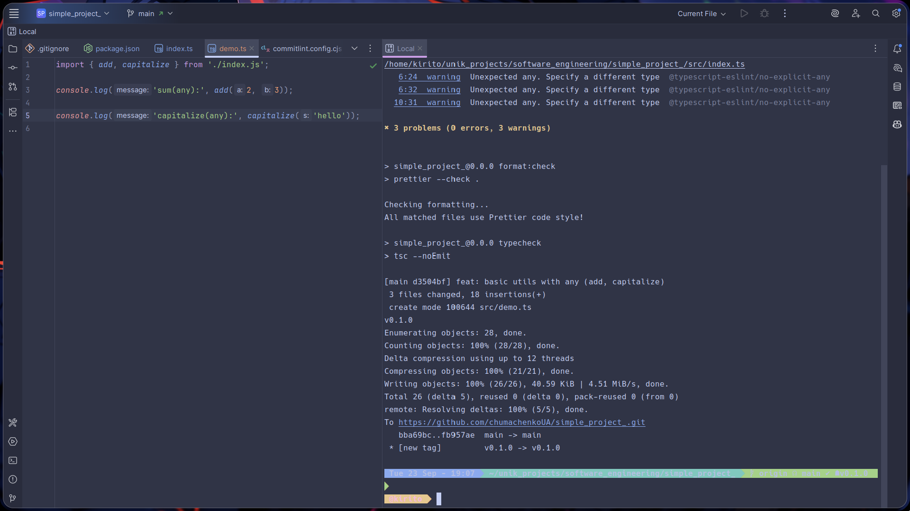
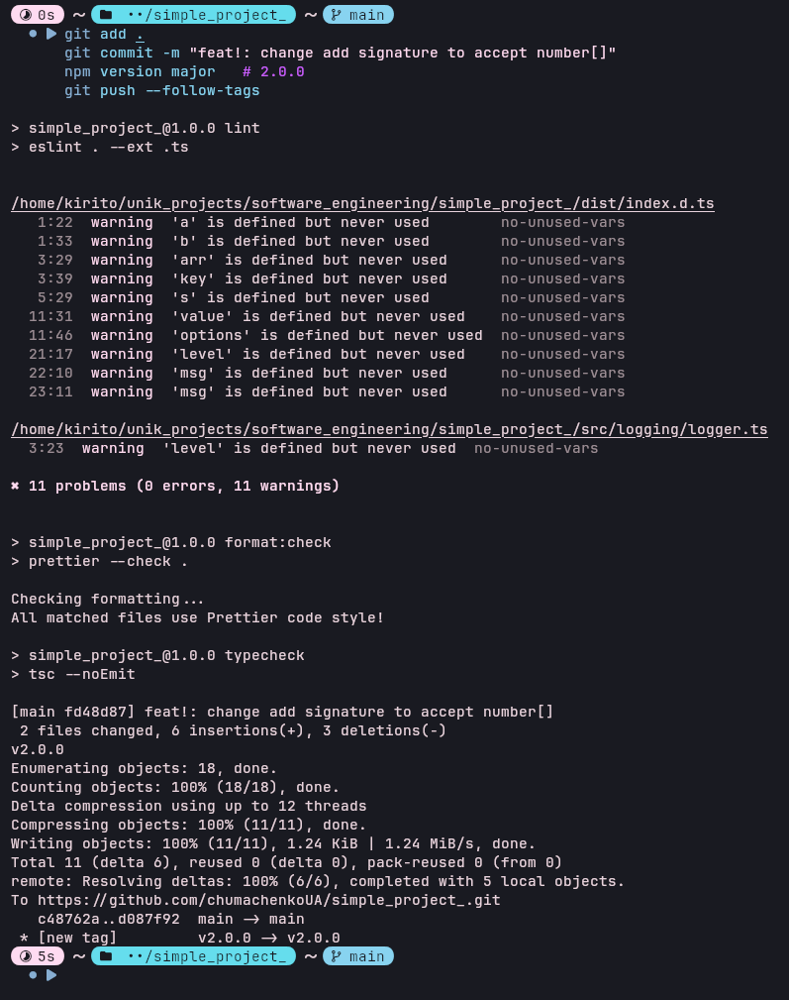

# simple_project

Невелика навчальна бібліотека на TypeScript, що демонструє:

- базову структуру npm-пакету з підтримкою ESM і CJS, типами та `exports`;
- роботу зі змінними середовища через `dotenv` та валідацію конфігурації через `zod`;
- приклади простих утилітних функцій та простого логера.

Мета проєкту — показати мінімальний, але якісний сетап: скрипти `build`/`demo`, лінтинг/форматування, семантичне версіонування та приклади використання.

## Швидкий старт

1. Встановіть залежності

   ```bash
   npm i
   ```

2. Запустіть демо-сценарій

   ```bash
   npm run demo
   ```

   Демо викликає основні функції та показує базовий вивід у консоль.

3. Зберіть пакет
   ```bash
   npm run build
   ```
   Результат збірки з’явиться у `dist/`:
   - CommonJS: `dist/index.cjs`
   - ES Module: `dist/index.mjs`
   - Типи: `dist/index.d.ts`

Додатково:

- Лінтинг: `npm run lint` / автофікс `npm run lint:fix`
- Перевірка форматування: `npm run format:check` / форматування `npm run format`
- Type-check: `npm run typecheck`

## Використання

Пакет експортує функції `add`, `capitalize`, `formatNumber`, клас `Logger` і тип `LogLevel`. Приклади:

### Імпорт

- ES Module

  ```ts
  import { add, capitalize, formatNumber, Logger, type LogLevel } from 'simple_project';
  ```

- CommonJS
  ```js
  const { add, capitalize, formatNumber, Logger } = require('simple_project');
  ```

### Функції

- add

  ```ts
  const sum = add([2, 3, 4]); // 9
  ```

- capitalize

  ```ts
  const title = capitalize('hello'); // "Hello"
  ```

- formatNumber

  ```ts
  // За замовчуванням точність береться з APP_PRECISION (.env, див. нижче)
  const a = formatNumber(123.456); // наприклад, "123.46" якщо APP_PRECISION=2

  // Можна перевизначити точність параметром
  const b = formatNumber(123.456, { precision: 3 }); // "123.456"
  ```

- groupBy

  ```ts
  interface User {
    id: number;
    name: string;
    role: 'admin' | 'user';
  }

  const users: User[] = [
    { id: 1, name: 'Ivan', role: 'user' },
    { id: 2, name: 'Oksana', role: 'admin' },
    { id: 3, name: 'Petro', role: 'user' },
  ];

  // Групування за роллю
  const grouped = groupBy(users, 'role');
  // Результат:
  // {
  //   user:  [{ id: 1, name: 'Ivan', role: 'user' }, { id: 3, name: 'Petro', role: 'user' }],
  //   admin: [{ id: 2, name: 'Oksana', role: 'admin' }]
  // }

  // Групування за ім’ям
  const byName = groupBy(users, 'name');
  // {
  //   Ivan:  [{ id: 1, name: 'Ivan', role: 'user' }],
  //   Oksana: [{ id: 2, name: 'Oksana', role: 'admin' }],
  //   Petro: [{ id: 3, name: 'Petro', role: 'user' }]
  // }
  ```

- Logger

  ```ts
  const logger = new Logger('info' as LogLevel);

  logger.info('Application started'); // [INFO] Application started
  logger.debug('Extra debug'); // Не виведеться для рівня "info"
  ```

## Конфігурація через .env

Конфігурація завантажується з `.env` (через `dotenv`) і валідується `zod`. Доступні ключі:

- `APP_PRECISION` — ціле число 0..10, точність форматування чисел. За замовчуванням: `2`.
- `LOG_LEVEL` — один з літеральних рівнів логування: `silent` | `info` | `debug`. За замовчуванням: `info`.

Приклад `.env`:

```env
APP_PRECISION=2
LOG_LEVEL=info
```

Зверніть увагу:

- Якщо змінні не задані, підставляться валідні дефолтні значення.
- `formatNumber` за замовчуванням використовує `APP_PRECISION`.
- `Logger` керується `LOG_LEVEL` (див. приклад вище).

## Еволюція проєкту (Semantic Versioning)

- **0.0.0** — початкова ініціалізація проєкту (`npm init`, конфіги, husky тощо).
- **0.1.0** — додано прості утиліти (`add`, `capitalize`) з `any`.
- **0.2.0** — заміна `any` на базові типи (`number`, `string`).
- **0.3.0** — додано функцію `formatNumber` із типом `NumberFormatOptions`.
- **0.4.0** — додано інтерфейс `User` та generic-функцію `groupBy`.
- **0.5.0** — додано клас `Logger` і валідацію `.env` через `zod`.
- **1.0.0** — стабілізація публічного API, суворіші ESLint-правила (заборона `any`), додано експорти у `package.json`.
- **2.0.0** — breaking change: функція `add` тепер приймає масив `number[]`.

## Релізи та теги

- Сторінка релізів: https://github.com/chumachenkoUA/simple_project/releases
- Теги релізів: https://github.com/chumachenkoUA/simple_project/tags

---

Ліцензія: MIT

---

## For teacher

Нижче наведені скріншоти виконання завдання по версіях.

### Task 1 (v0.0.0)


### Task 2 (v0.1.0)

  
  


### Task 3 (v0.2.0)

  
  


### Task 4 (v0.3.0)

  
  


### Task 5 (v0.4.0)

  
  


### Task 6 (v0.5.0)

  
  


### Task 7 (v1.0.0)

  
  


### Task 8 (v2.0.0)

  
  

